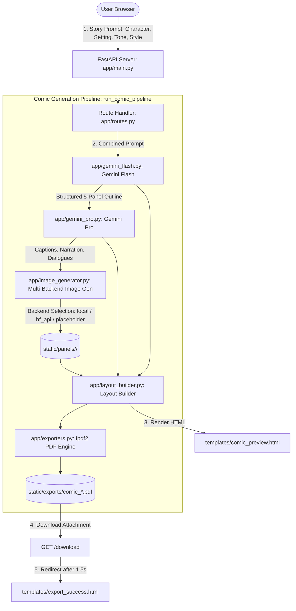

# ComicCraft — AI Comic Story Creator using Gemini Models
**Naan Mudhalvan Project Submission**

---

## 1. Project Overview

**ComicCraft** is an end-to-end full-stack web application developed in Python with **FastAPI**, **Jinja2**, and **Google Gemini Generative AI**. The application automates the entire comic creation lifecycle from a single premise:
1. Generates a structured 5-panel storyline and visual prompts using **Gemini Flash**.
2. Expands the outline into ambient sound captions, narration, and character dialogues using **Gemini Pro** (with automatic fallback to Gemini Flash).
3. Generates high-resolution comic illustrations (512x512) for each panel via a switchable image generation backend (**Stable Diffusion local**, **Hugging Face Inference API**, or **Pillow Gradient Art**).
4. Assembles dialogue and visual art into an intuitive responsive layout.
5. Compiles and exports the complete story into a print-ready multi-page PDF document using **fpdf2**.

---

## 2. System Architecture



---

## 3. Technology Stack

- **Backend Framework**: FastAPI 0.110+, Uvicorn (ASGI web server).
- **Templating & Frontend**: Jinja2 with responsive embedded CSS, vanilla JavaScript for async downloads and loading transitions.
- **Language Models**: Google GenAI SDK (`google-genai`), `gemini-2.5-flash`, `gemini-2.5-pro` (retired 1.5 models replaced).
- **Image Generation Backends**:
  - `local`: PyTorch, Hugging Face `diffusers` (`StableDiffusionPipeline`), `transformers`, `accelerate`.
  - `hf_api`: `huggingface_hub.InferenceClient` (text-to-image).
  - `placeholder`: `Pillow` (PIL) dynamic 512x512 comic gradient illustration with panel titles and badges.
- **PDF Document Engine**: `fpdf2` (modern API using `epw`, `new_x`, `new_y`, and TrueType Unicode fonts).
- **Typography**: TrueType `DejaVuSans.ttf` & `DejaVuSans-Bold.ttf` for full Unicode safety.
- **Testing**: `pytest`, Starlette `TestClient`, `httpx`.

---

## 4. Environment Setup & Installation

### Prerequisites
- Python 3.10 – 3.12
- Windows (PowerShell) or Linux/macOS (Bash)

### 4.1 Create Virtual Environment
#### On Linux / macOS:
```bash
python3 -m venv comiccraft-env
source comiccraft-env/bin/activate
```

#### On Windows (PowerShell):
```powershell
python -m venv comiccraft-env
.\comiccraft-env\Scripts\Activate.ps1
```

### 4.2 PyTorch Installation (Hardware-Specific Step)
Install PyTorch matching your hardware before installing other requirements:

- **For NVIDIA GPU (CUDA 12.1)**:
  ```bash
  pip install torch torchvision --index-url https://download.pytorch.org/whl/cu121
  ```
- **For CPU Only**:
  ```bash
  pip install torch torchvision --extra-index-url https://download.pytorch.org/whl/cpu
  ```

### 4.3 Install Application Dependencies
```bash
pip install -r requirements.txt
```

---

## 5. Environment Variables (`.env`)

Copy `.env.example` to `.env`:
```bash
cp .env.example .env
```

| Variable | Description | Default / Example |
|---|---|---|
| `GEMINI_API_KEY` | Google Gemini API Key from Google AI Studio | `AIzaSy...` |
| `HF_API_KEY` | Hugging Face Access Token with Inference permission | `hf_...` |
| `GEMINI_FLASH_MODEL` | Flash model ID for 5-panel outline generation | `gemini-2.5-flash` |
| `GEMINI_PRO_MODEL` | Pro model ID for story & dialogue generation | `gemini-2.5-pro` |
| `IMAGE_BACKEND` | Image backend: `auto`, `local`, `hf_api`, `placeholder` | `auto` |
| `SD_MODEL_ID` | Local Diffusers model repository ID | `stable-diffusion-v1-5/stable-diffusion-v1-5` |
| `HF_IMAGE_MODEL` | Hugging Face Inference API image model ID | `stabilityai/stable-diffusion-xl-base-1.0` |
| `PORT` | Localhost web server port | `3000` |

---

## 6. How to Run & How to Test

### 6.1 Check Model Availability
Run the model validation script:
```bash
python scripts/check_models.py
```

### 6.2 Start the Web Server
```bash
uvicorn app.main:app --host 0.0.0.0 --port 3000 --reload
```
Open **`http://localhost:3000`** in your browser.

### 6.3 Run the Test Suite
Execute the automated test suite:
```bash
pytest -v tests/
```

---

## 7. HTTP Endpoints Table

| Method | Endpoint | Description |
|---|---|---|
| `GET` | `/` | Renders `index.html` with form input options. |
| `POST` | `/generate` | Accepts form data, runs full pipeline, and renders `comic_preview.html`. |
| `POST` | `/generate-comic/json` | Pydantic JSON API returning `{comic_id, layout, pdf_path, models_used}`. |
| `GET` | `/download` | Serves generated PDF file as an attachment with path traversal protection. |
| `GET` | `/export-success` | Renders `export_success.html` confirmation page. |
| `GET` | `/test-image` | Generates a single test illustration verifying the image backend. |
| `GET` | `/health` | Returns active Gemini models and image backend status. |

---

## 8. Milestone to File Mapping

| Milestone | Activity | Implementation Files |
|---|---|---|
| **M1** | Environment & Setup | `requirements.txt`, `.env`, `.env.example`, `static/fonts/`, `static/images/` |
| **M2** | Core AI Generation | `app/config.py`, `app/gemini_flash.py`, `app/gemini_pro.py`, `app/image_generator.py` |
| **M3** | Layout & PDF Assembly | `app/layout_builder.py`, `app/exporters.py` |
| **M4** | FastAPI & Jinja2 Templates | `app/main.py`, `app/routes.py`, `templates/index.html`, `templates/comic_preview.html`, `templates/export_success.html` |
| **M5** | Verification & Testing | `scripts/check_models.py`, `tests/test_layout.py`, `tests/test_exporters.py`, `tests/test_routes.py` |

---

## 9. Deviations from Original Document and Technical Rationale

1. **Deprecated 1.5 Models Retired**: The outdated project document referenced Gemini 1.5 models. Following Google's current API standards, we utilize `gemini-2.5-flash` and `gemini-2.5-pro` via the modern `google-genai` SDK.
2. **Modern SDK Usage (`google-genai`)**: Replaced deprecated `google-generativeai` with `google.genai.Client`, adhering to Google's official SDK architecture.
3. **PDF Library Migration (`fpdf2`)**: The legacy `pyfpdf` library is unmaintained and incompatible with Python 3.10+. We adopted `fpdf2` using modern `pdf.epw`, `new_x`, `new_y` layout methods and DejaVu TrueType fonts for full Unicode compliance.
4. **Stable Diffusion Repository Update**: The original Hugging Face model path was moved to `stable-diffusion-v1-5/stable-diffusion-v1-5`.
5. **Switchable Image Generation Backend**: Added `auto`, `local`, `hf_api`, and `placeholder` options with graceful fallback hierarchy so testing and viva evaluations never stall due to lack of local GPU or cloud quotas.
6. **Threadpool Execution & Asynchronous Safety**: CPU and external AI operations are scheduled to prevent blocking the FastAPI ASGI event loop.
7. **Robust Story Parsing**: The regex parser keys strictly on `**Panel N:` numbers rather than zip order, ensuring accurate alignment between outline scene descriptions and dialogues.

---

## 10. Architectural Decisions Log

- **D1: TrueType Unicode Font Embedding**: Bundled DejaVu Sans fonts in `static/fonts/` with automatic Latin-1 ASCII fallback to guarantee PDFs never crash on curly quotes or em-dashes.
- **D2: Fixed Character Seed & Prompt Anchoring**: Embedded fixed character descriptions in all 5 panel image prompts and utilized a consistent random seed per comic to preserve protagonist visual continuity.
- **D3: Path Traversal Security**: Strict validation on `/download?pdf_path=...` ensuring requested files reside strictly within `static/exports/`.
- **D4: Error Resilience in Web Routes**: Form errors re-render `index.html` with friendly notification banners and prefilled user inputs rather than unhandled 500 error pages.

---

## 11. Known Limitations & Future Work

- **Local GPU Memory**: Running local Stable Diffusion requires ~4GB VRAM in float16; environments without dedicated GPUs utilize the Hugging Face API or Pillow gradient backend.
- **Future Enhancements**:
  - User accounts and authentication (OAuth2 / Firebase Auth).
  - Multi-chapter continuing comic series.
  - Interactive speech bubble drag-and-drop editor.
